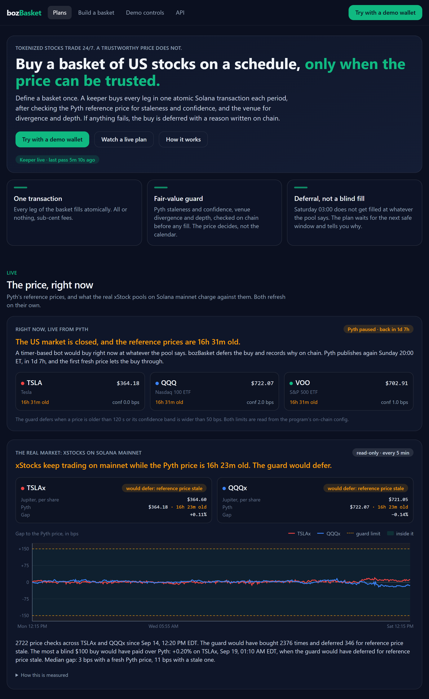
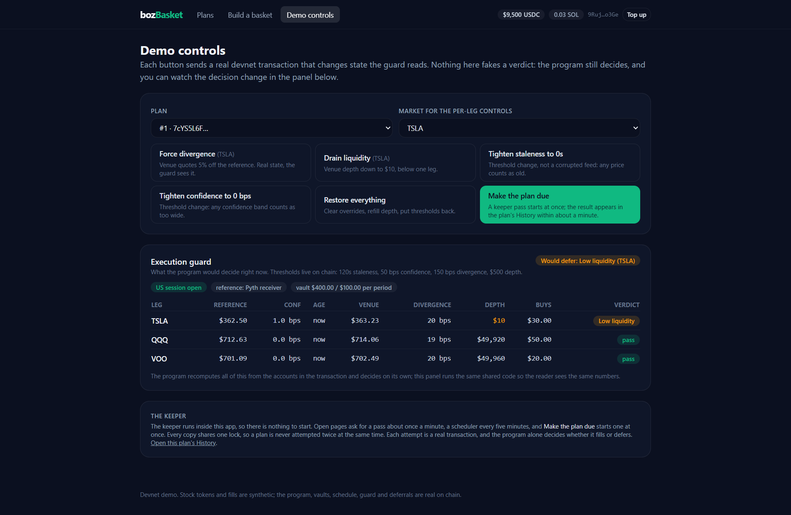
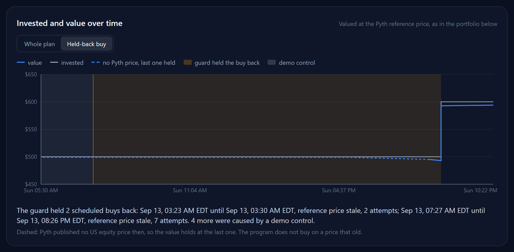

# bozBasket

**A recurring-buy robo-investor for tokenized US stocks on Solana that refuses
to buy when the reference price cannot be trusted.**

Define a basket once — say TSLA 50% / QQQ 30% / VOO 20%, $100 weekly — deposit
USDC into a vault only you control, and a keeper buys the whole basket in one
atomic transaction every period. Before each buy the program checks the Pyth
reference price and the venue. If anything is off, the buy is **deferred with
a reason code written on chain** instead of filled blind.

- Repository: https://github.com/elaris-xyz/bozBasket
- Live demo: https://boz-basket-web.vercel.app
- Video: _add the video link_
- Devnet program: [`4Tv5nEbh6b6EGNhep7rpeLy7NXpiz8AkRmVi36iwxVuR`](https://explorer.solana.com/address/4Tv5nEbh6b6EGNhep7rpeLy7NXpiz8AkRmVi36iwxVuR?cluster=devnet)



---

## The problem

Tokenized stocks trade 24/7. The price they are measured against does not.
Pyth publishes US equity prices well beyond the regular session, but from
Friday 20:00 ET to Sunday 20:00 ET nothing is published and the last price
just ages: two days in every seven, plus holidays, while the tokens keep
trading on thinner on-chain liquidity. On this deployment, attempts at 19:00 ET
on a Sunday read a TSLA price 169,215 seconds old; at 20:26 ET the same feed
was fresh again and the basket filled.

Existing recurring-buy tools fire on a timer. A Saturday 03:00 order fills at
whatever the pool says, with no check that the price means anything. And
buying a basket of N stocks means N orders, N fees, and drift between the legs
while they execute.

bozBasket is the boring habit — buy the same basket every week — made safe on
a market that never closes.

## The guard

`execute_basket` is keeper-signed but keeper-untrusting: the program recomputes
everything from the accounts in the transaction and decides for itself.

| Check | Fails when | Reason |
|---|---|---|
| Publish time | the reference is older than `max_staleness_secs` | `1 REFERENCE_STALE` |
| Confidence | `conf / price` exceeds `max_conf_bps` | `2 CONFIDENCE_TOO_WIDE` |
| Session | outside the regular session, if the keeper runs `strict` | `3 MARKET_CLOSED` |
| Venue price | it differs from the reference by more than `max_divergence_bps` | `4 DIVERGENCE` |
| Venue depth | it is below the leg size or `min_liquidity_usdc` | `5 LOW_LIQUIDITY` |
| Vault | it cannot cover one period | `6 INSUFFICIENT_BALANCE` |

A deferral is a **successful transaction**: the reason lands in `Plan.last_reason`,
`deferrals` increments, a `Deferred` event is emitted, and the instruction
returns `Ok`. The user can see why they were not filled, on chain, forever.
If every check passes, all legs fill by CPI in that same transaction, or none
of them do.

Codes 1, 2, 4, 5 and 6 are enforced by the program from data in the
transaction. Code 3 is the keeper's, and only under its `strict` policy, which
does not submit outside the regular session. The deployment runs `guarded`: it
submits whenever a plan is due and lets the program judge the price itself,
because the calendar is the wrong test. Outside the regular session Pyth still
publishes: at 02:38 ET on a Monday the three feeds were seconds old, with
confidence under 1 bp. On a weekend the price is stale, and the program defers
with code 1, on chain.

The plan page then says when the buy will be tried again. On a weekend that
is when Pyth publishes US equity prices again, Sunday 20:00 ET, and how long
from now; for a venue or confidence problem, the keeper's next pass, within
minutes; for a short vault, how much to deposit. The time is a forecast for
the screen only: the program still judges the publish time itself.

Every code has been reproduced end to end on devnet; the transactions are
listed in [`docs/DEMO.md`](docs/DEMO.md).



The demo controls change real devnet state, and the panel above recomputes
the program's decision from it. Pressing **Make the plan due** then sends the
transaction, and the program records its own verdict.

## One weekend on devnet

Four plans on the deployment were due on Sunday 2026-09-13. (A new plan is due
at once, and the demo's "make the plan due" control moves only the schedule,
never a price.) The TSLA, QQQ and VOO feeds had last published on Friday at
20:00 ET. Between 07:27 and 19:00 ET the keepers attempted the four plans 25
times, and every attempt was a transaction that deferred with code 1 on prices
35 to 47 hours old. None was forced by a demo control. At 20:26 ET the feeds
were publishing again, and one keeper pass filled all four baskets.

Each plan page scores its held-back buys against the stale price it refused,
reference to reference: the four fills came in $1.10 to $1.20 per $100 below
it. That was one weekend in which prices happened to drift down; when they
open higher, the same card shows the cost, in red. The guard exists to refuse
prices nobody can vouch for, not to time the market.

The plan page draws the same weekend. It charts what the plan has put in
against what it is worth, from its first activity to now: Pyth's silence is a
dashed, flat stretch at the last price it published, the held-back buy is
shaded amber, and demo-control tests are shaded grey. The value between buys
comes from reference prices the keeper stores every quarter hour, one Hermes
call for all three feeds, because the Pyth key is rate-limited (six parallel
requests drew 429) and the executions need it; drawing a chart never calls
Hermes.



## The real market, read-only

The fills above are synthetic; the problem is not, so it is measured on the
real market. Every keeper pass, at most once every four minutes, asks Jupiter
what $100 of USDC buys in TSLAx and QQQx, the xStocks on Solana mainnet, and
runs that price and the Pyth price through the same `checkLeg` the keeper
uses, with the default limits. Nothing is signed or sent. The landing page
shows the latest verdict for each, the gap between the pool and Pyth over the
last week, and how often the guard would have bought or deferred.

Two details decide whether the number means anything:

- xStocks are Token-2022 mints whose scaled UI amount carries the issuer's
  share multiplier, which folds dividends into the share count. The check
  reads it from the mint. Without it, QQQx read 44 bps above Pyth on
  2026-09-14; with it, 17.
- The reference age is Pyth's own publish time, never restamped.

The window that matters is the weekend, when the pools keep quoting against a
price that stopped on Friday. The live check has none on record until Friday
2026-09-18 at 20:00 ET and keeps collecting through judging; the eight
weekends before it are measured from history below. VOOx is left out: the
token exists, but no pool holds it, so Jupiter finds no route and there is no
market price to check (checked 2026-09-20). VOO stays in the devnet baskets.

## Eight weekends, measured

The weekends before the live check are measured from history: hourly candles
of the deepest USDC pool of each xStock (GeckoTerminal, divided by the share
multiplier) and Pyth's last price before each weekend and first price after it
(Hermes history, which reaches back about eight weeks). Every hour the pool
traded in between is compared with that first price back.
`apps/keeper/scripts/backtest-weekends.ts` reproduces it, and the output is
[`deploy/weekend-backtest.json`](deploy/weekend-backtest.json).

| Weekends of 2026-07-24 to 2026-09-11 | TSLAx | QQQx |
|---|---|---|
| Traded weekend hours | 405 | 399 |
| Weekend buy against the next Pyth price, median distance | 53 bps | 45 bps |
| Weekday pool against Pyth at the same moment, median distance | 13 bps | 15 bps |
| Worst weekend buy, above the next Pyth price | +1.92% | +1.84% |
| Weekend hours beyond the guard's 150 bps limit | 5.9% | 3.0% |
| Friday's stale price against the next Pyth price, median move | 60 bps | 43 bps |
| A weekly buy at Saturday 12:00 ET, mean against the next Pyth price | −27 bps | −8 bps |
| Weekends on which that Saturday buy paid more | 3 of 8 | 3 of 8 |

What this does and does not show. Waiting did not save money on average: over
these eight weekends prices mostly rose by the time Pyth came back, so the
Saturday buyer paid a little less. The weekend measure also spans up to two
days of market movement, while the weekday one compares prices at the same
moment. What it shows is how uncertain a weekend price is. A blind TSLAx buy
landed anywhere from 1.96% below to 1.92% above the first price anyone could
vouch for, and the Friday price a timer would have trusted was itself a median
60 bps from where Pyth came back. The guard removes that uncertainty. It does
not promise a better price, and the landing page shows these numbers as they
are.

## Guard API

The guard is also a public HTTP API, so any app about to buy an xStock on
Solana mainnet (a wallet, a recurring-buy tool, a lending protocol pricing
collateral) can ask the question bozBasket's keeper asks, for its own size and
its own limits:

```bash
curl "https://boz-basket-web.vercel.app/api/v1/verdict?symbol=TSLAx&usdc=500"
```

It takes a live Jupiter quote for that size and the latest Pyth price, runs
both through `checkLeg`, and answers `buy`, `defer` or `unavailable` for
each xStock. With the verdict come the reason code the program would write and
the numbers behind it: the Pyth price with its age and confidence, and the
price per share Jupiter quotes, with the issuer's multiplier applied, its price
impact and the signed gap. `/api/v1/history` serves the recorded checks behind
the landing-page chart, and `/api/v1/openapi.json` describes both endpoints.
[`/developers`](https://boz-basket-web.vercel.app/developers) documents them
and sends live requests from the page.

It is read-only, needs no key, is open to browsers, caches identical requests
for 15 seconds and allows 60 requests a minute per address. It answers for a
quote, not a fill, and runs on a free tier with no uptime promise, so a caller
should ask right before swapping and treat `unavailable` as `defer`.

## How bozBasket uses Pyth

Pyth is not a price label on this app; every decision runs through it.

- **On chain, per leg, in the transaction that buys.** The keeper fetches
  signed updates from Hermes and posts them to the Pyth receiver in the same
  transaction bundle as `execute_basket`. The program then requires, for every
  leg, that the `PriceUpdateV2` account is owned by the receiver, carries that
  leg's feed id, is fully verified (`VerificationLevel::Full`), is younger than
  `max_staleness_secs`, and has a confidence band inside `max_conf_bps`
  ([`execute.rs`](programs/basket_dca/src/execute.rs)). The venue's price is
  judged against it only after that.
- **The publish time is the product.** Pyth publishes US equities from Sunday
  20:00 to Friday 20:00 ET, overnight and pre-market included, and nothing in
  between. That silence is what the guard refuses to buy through, what the
  plan page draws as a dashed line, and what "tried again Sunday 20:00 ET"
  counts down to.
- **History, for evidence.** Hermes `/v2/updates/price/{ts}` rebuilds the
  eight measured weekends and the plan charts' prices before the keeper began
  storing them; the keeper now stores all three feeds every quarter hour.
- **The real market.** The mainnet check and the Guard API run the same
  `checkLeg` on the Pyth price against a live Jupiter quote for real xStocks.
- **Limits of the key in use.** It is entitled to TSLA, QQQ and VOO equities
  only. Pyth also publishes xStock feeds (`Crypto.TSLAX/USD`) and redemption
  rates (`Crypto.TSLAX/TSLA.RR`); with them the guard could compare the token
  with its underlying from Pyth alone, around the clock.

## Architecture

```
 Browser (Next.js, demo burner wallet or any Solana wallet)
   │  create_plan · deposit · withdraw · pause         (the user signs)
   ▼
 Anchor program: basket_dca
   ├─ Config  (global thresholds, keeper, fill and reference programs)
   ├─ Plan    (PDA per user+id: legs, weights, schedule, counters, reasons)
   ├─ Vault   (USDC token account, authority = the Plan PDA)
   └─ execute_basket   (keeper signs; the program checks the guard)
   ▲                              │ CPI: take USDC, mint/receive stock tokens
   │  Executed / Deferred         ▼
 Keeper (in-app, locked)       Fill venue
   ├─ session calendar            ├─ devnet:  mock_market
   ├─ Pyth Hermes + receiver      └─ mainnet: Jupiter (not built)
   └─ Postgres ledger  ─────────────────────►  read by the web app
```

The chain is the source of truth for plan state, schedule and the last
decision. The keeper holds no authority over user funds: it can only *attempt*
an execution. Postgres is a cache: of the decisions the chain already holds,
and of the quarter-hourly Pyth prices the charts draw. Delete it and nothing
is lost that the chain and Pyth do not hold: `scripts/recover-ledger.ts`
rebuilds a plan's history from its transactions, and
`scripts/backfill-references.ts` refetches the prices from Hermes history.

The guard's arithmetic exists twice on purpose — in Rust for the program, and
once in TypeScript (`packages/shared/src/guard.ts`) shared by the keeper and
the web app's guard panel, so the user sees the same numbers the program will
use. `scripts/scenarios.ts` checks the two against each other on devnet.

## What is real and what is synthetic

Devnet has no xStocks and no Jupiter liquidity, so parts of the demo are
necessarily mocked. Being precise about which parts:

**Real, on chain, no shortcuts**
- The `basket_dca` program: plan accounts, vault PDAs, the schedule, every
  guard check, the atomic multi-leg CPI, the reason codes and counters.
- Non-custodial vaults. The vault's authority is the plan PDA; only the owner
  can withdraw, at any time, including while the plan is active.
- Pyth price updates, signed by Pyth and verified on chain by the official
  receiver program, in the same transaction as the execution.
- Off chain, but real: the keeper's session calendar, derived from Pyth's own
  published market hours. Only the keeper's `strict` policy uses it; the
  deployment runs `guarded`, and the program never checks the calendar.

**Synthetic on devnet, and clearly labelled in the UI**
- `mAAPL`-style stock tokens and their fills. `mock_market` mints them at the
  reference price plus a configurable spread. There is no counterparty and no
  real share behind the token.
- Mock USDC, minted by a faucet so judges do not have to source devnet tokens.
- Demo tests. The scenario sweep behind `docs/DEMO.md` ran on the demo plan,
  so its fills and deferrals are in that plan's history, marked as demo tests,
  shaded grey on its chart, and never counted by the scorecard. A demo test's
  period ends as soon as the market defers for a reason of its own.
- An optional *mock reference* mode. With the real Pyth receiver, nothing is
  published for US equities from Friday 20:00 ET to Sunday 20:00 ET, so a demo
  in that window can only ever show deferrals. `scripts/set-reference.ts mock`
  points the program at a reference account the keeper restamps, so a fill can
  be shown at any hour. The guard panel states which mode is live, and the
  program enforces the account's owner either way.
- Two demo controls tighten a `Config` ceiling rather than corrupting a feed,
  because nobody can make Pyth publish a bad price on demand. The other two
  change the venue's real quote and depth. `docs/DEMO.md` spells out which is
  which. Left untouched for ten minutes, a changed demo restores itself on the
  next keeper pass, so one visitor cannot leave it broken for the next.

**Not built**
- Mainnet execution through Jupiter. The program is structured for it — the
  fill venue and the reference program are both `Config` fields — but it is
  not implemented, so it is not claimed. What does run against mainnet is the
  read-only check described in [The real market](#the-real-market-read-only).

## What comes next

What each step rests on has been measured; the steps themselves are not built.

- **Real buys on mainnet, without custody or a new program.** Build the
  Jupiter swap for the user's own wallet with its minimum output set from the
  Pyth price and the guard's divergence limit: Jupiter's program then enforces
  that limit on chain, and staleness and confidence are checked before the
  swap is built, as the Guard API already does. Simulated against mainnet on 2026-09-18 for a $2 USDC to
  TSLAx buy: with the Pyth-derived floor the swap went through; with a floor
  1% above the pool it reverted (`0x1771`, slippage exceeded). A recurring
  plan on mainnet then needs either a capped delegation or the vault program
  deployed there.
- **The token against its underlying, from Pyth alone.** Pyth publishes
  xStock feeds (`Crypto.TSLAX/USD`) and redemption rates
  (`Crypto.TSLAX/TSLA.RR`) around the clock. With a key entitled to them, the
  guard compares a token with its stock without a DEX quote, and weekends show
  how far the token moved while the stock's price stood still.
- **More stocks** are configuration: AAPL, NVDA and SPY feeds exist, and the
  only limit today is the key's entitlement.
- **Holidays** in the forecast the screen shows ("tried again Sunday 20:00
  ET"). The program already handles them: it judges the publish time.

## Why Solana

- **Atomicity is the product.** A basket of four legs is one transaction that
  either completes or reverts. On a chain where each leg is its own
  transaction, a guard can pass for leg one and fail for leg four, leaving the
  user half-invested at prices they never agreed to.
- **Fees make small baskets viable.** Splitting $100 four ways costs a
  fraction of a cent. At Ethereum gas, the fees would exceed the legs.
- **Pyth is native**, with pull updates verified on chain in the same
  transaction that consumes them — which is exactly what a fair-value guard
  needs. It is also why staleness is *visible* rather than hidden: the
  publish time travels with the price.
- The tokenized stocks already live here.

## Is it running?

The keeper runs wherever it is asked to, and every copy takes the same
Postgres lock, so there is never more than one pass at a time or more than one
scheduled pass a minute:

- **Inside the web app.** Any open page asks for a pass about once a minute,
  and "make the plan due" in the demo controls starts one at once. The pass
  runs in a serverless function after the response has been sent.
- **An external scheduler** calling `/api/keeper/tick` every five minutes covers
  the hours nobody has the app open. The endpoint is public on purpose: the lock
  bounds it, and a pass can only attempt executions the program guards.
- **A scheduled GitHub Action**, whose runs are public logs in this
  repository. GitHub fires it irregularly, so it is a backstop, not the clock.

The app reports when the keeper last ran, in red when it is late, so a plan
that did not fill is visibly either deferred with a reason or waiting on a
keeper.

## Quickstart

Requires Node 20+, pnpm 9, Rust, the Solana CLI and Anchor 0.30.1.

```bash
git clone https://github.com/elaris-xyz/bozBasket.git && cd bozBasket
pnpm install
cp .env.example .env        # fill in PYTH_API_KEY and SOLANA_RPC_URL at least
```

Run the web app against the already-deployed devnet programs:

```bash
pnpm --filter web dev       # http://localhost:3200
```

Click **Try with a demo wallet**: it generates a burner keypair in your
browser, funds it with SOL and mock USDC, and you can build a basket
immediately. No extension required.

Run the keeper against your own plan:

```bash
source tools/env.sh
pnpm --filter keeper start
# or one pass:  pnpm --filter keeper once
```

Build and test the programs:

```bash
anchor build
node tools/sync-idl.mjs         # refresh the committed interface in idl/
cargo test --workspace          # 9 pure-Rust tests
tools/test-local.sh             # 32 Anchor tests on a local validator
pnpm --filter keeper test       # 28 guard, calendar, mainnet-check and backtest tests
pnpm --filter web test          # 58 scorecard, chart, Guard API and wording tests
```

Deploy your own copy:

```bash
anchor deploy --provider.cluster devnet
pnpm --filter keeper setup:devnet     # config, mock USDC, three markets
pnpm --filter keeper exec tsx scripts/setup-faucet.ts
```

`tools/env.sh` (and `tools/env.ps1`) put the toolchain on `PATH` and load
`.env`. On Windows see `CLAUDE.md` for the toolchain notes; the build needs a
MinGW `dlltool`, and the pinned `Cargo.lock` exists because platform-tools
ships rustc 1.79.

## Deployed on devnet

| What | Address |
|---|---|
| `basket_dca` program | `4Tv5nEbh6b6EGNhep7rpeLy7NXpiz8AkRmVi36iwxVuR` |
| `mock_market` program | `A6pvN8KEYn5EXcgsRbzZUqBNjA5hFqFn6Ks2Li7SPMxS` |
| Config PDA | `FBsvtKfyPYihMUdneeedkHSzPqxoKpnC7bRYkrBrzR3a` |
| Mock USDC mint | `2X3txP6u2uNppAT4DzT6K7NuXTvKArFDPtQAs8tWU7Vt` |
| mTSLA / mQQQ / mVOO mints | see [`deploy/devnet.json`](deploy/devnet.json) |

Pyth feeds: `Equity.US.TSLA/USD`, `Equity.US.QQQ/USD`, `Equity.US.VOO/USD`.
These three are what the Pyth API key in use is entitled to; the feed ids are
identical on devnet and mainnet.

## Program reference

`basket_dca`

| Instruction | Signer | Effect |
|---|---|---|
| `init_config` / `update_config` | admin | global thresholds, keeper, fill and reference programs |
| `create_plan` | user | validates weights sum to 10 000, creates the Plan and its vault |
| `deposit` / `withdraw` | user | move USDC; a withdrawal below one period pauses the plan |
| `update_plan` | user | change the amount, cadence or end date; weights are fixed |
| `set_paused` | user | pause or resume |
| `execute_basket` | keeper | the guard, then all legs or none |
| `nudge_plan` | admin | demo control: make a plan due now |

`Plan` holds up to 8 legs (the demo uses 3; 4 is the practical transaction-size
limit), each with a mint, a weight in basis points, a Pyth feed id and the
cumulative units bought, which is what makes average cost exact.

## Limitations

- Devnet only, with the mocks described above.
- Keepers coordinate through one Postgres lock, not consensus. A keeper holds
  no user funds and cannot move them, so the worst a failing one can do is not
  execute; any other instance takes over from chain state alone.
- This is a self-custody tool. It does not address eligibility or compliance
  for tokenized securities, which are issuer and jurisdiction specific.
- The mainnet check compares a quote, not a fill: the price can move between
  a quote and a swap, and $100 is small enough that depth rarely binds.
- Not audited. Nothing here should hold real money.

## Repository layout

```
programs/basket_dca     the product: plan lifecycle and the guard
programs/mock_market    devnet fill venue and reference relay (synthetic)
apps/keeper             the once-a-minute executor, plus operational scripts
apps/web                Next.js app: builder, plan page (chart, scorecard, history), guard panel, demo controls
packages/shared         guard arithmetic, session calendar, presets, reason codes
tests                   Anchor integration tests
docs/DEMO.md            demo script and the transaction for every reason code
docs/NETWORK.md         what the network and Pyth actually allow, measured
```

## License

MIT. See [LICENSE](LICENSE).
